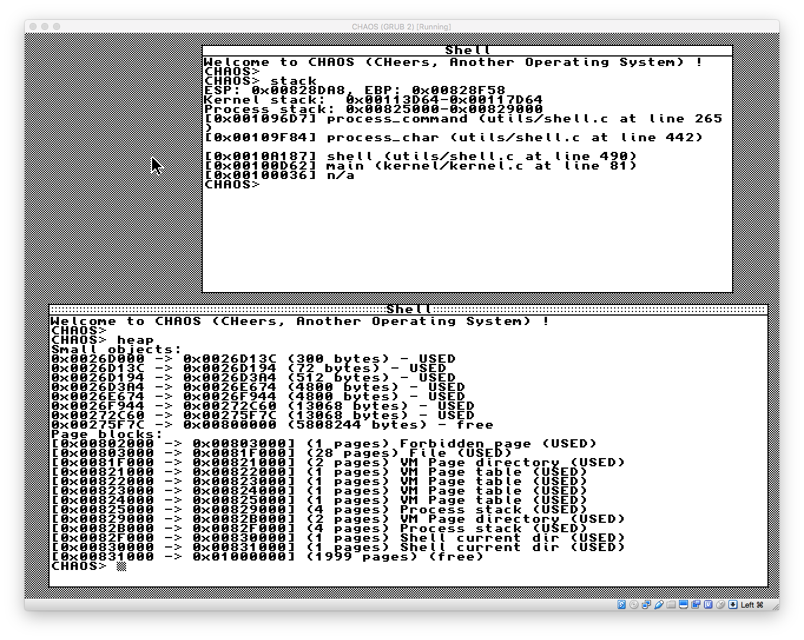

# The kernel

Here is what the kernel does:

- Heap: a simple heap management system (but getting better with time)
- It is using the i386 protected mode, and in particular the following feature of that mode:
  - Paging: this allows to map the virtual memory to the physical memory as the operating system sees fit. Right now, trying to access an unmapped page results in a page fault, resulting in the OS mapping that virtual page to a "forbidden page" (which displays a skull under a dump_mem() call) instead of crashing. Each process has its own virtual memory mapping.
  - Kernel and User mode (also known as the CPU ring 0 and ring 3 privileges): the shells are run in user mode, which means they cannot access as much stuff as in kernel mode
- It defines custom IRQs and interrupts handlers for the following:
  - IRQs handlers are used to capture keystrokes as well as mouse movements
  - IRQs are also used to set a scheduler that will be called at regular interval. This is key to implement multitasking
  - Custom interrupt 0x80 is used for system calls
- Processes:
  - Each process has its own stack, which is a requirement for multitasking
  - Each process has its own window on the screen
  - The processes are run in user mode, and can access some kernel functions by using interrupt 0x80. Raising this interrupt automatically freezes the user code and switches to kernel mode
- Preemptive multitasking: the interrupts from the scheduler are used to perform context switches at regular intervals, effectively implementing preemptive multitasking.
- A PS/2 mouse driver
- A basic windowing system:
  - This system is available in both 80x25 text mode and 640x480 VGA mode (monochrome). Both have windows and mouse support. Because switching from text to graphic mode (and vice versa) is complex in protected mode, the chaos.img disk image contains two versions of the kernel: one with the graphical environment (kernel_v.elf) and one with the text mode (kernel.elf). The version can be chosen at boot time.
  - The windows in VGA mode can be moved around with the mouse
- FAT12 support: allows to browse the directories and read files on the disk
- DWARF support: the kernel is an ELF binary, and has its debug libraries stored on the disk in DWARF format (kernel.sym and kernel_v.sym). The relevant kernel*.sym file gets loaded and processed at boot time, which allows to have a descriptive kernel stack trace in case of an error or a page fault (i.e. function name, file and line number)
- ELF support: allows to run an executable from the disk (right now limited to "run echo"). The executable is using a system call to print on the screen.
